# **TechReform BD 🛒 – PC Components at MSRP**

Welcome to **TechReform BD**, your ultimate destination for PC components in Bangladesh. Say goodbye to overpriced hardware! We bring you **authentic** CPUs, GPUs, motherboards, RAM, storage, and more—sourced directly from manufacturers. With **TechReform BD**, shop with confidence and build the PC of your dreams. 🚀

---

## **Key Features 💎**

- **Homepage**  
  Discover featured products, deals, and our latest offerings in a sleek, user-friendly layout.

- **Components Explorer**  
  Browse an extensive collection of products, including CPUs, GPUs, RAM, and storage. Use **filters** to find what you need and **sort** by price for quick comparisons.

- **Product Grids**  
  Enjoy visually appealing grids showcasing product images, names, and prices.

- **Detailed Product Pages**  
  Dive deeper into product details, including images, descriptions, specifications, and prices.

- **Role-Based Authentication**  
  - **Shopkeeper**: Manage products, orders, and users efficiently.
  - **User**: Browse products, build your cart, and place orders seamlessly.
  - **Blogger**: Share your thoughts and experiences with the community.

---

## **Built With 💻**

<div style="display: flex; flex-wrap: wrap;">
  
  
  
  
  
  
  
  
</div>

---

## **Installation Guide ⚙️**

Follow these steps to set up the project locally:

1. **Clone the repository:**

   ```bash
   git clone https://github.com/SharifdotG/TechReform-BD.git
   ```

2. **Navigate to the project folder:**

   ```bash
   cd TechReform-BD
   ```

3. **Set up a virtual environment:**

   ```bash
   pip install virtualenv
   python -m virtualenv venv
   ```

4. **Activate the virtual environment:**
   - On **Windows**:  

     ```bash
     venv\Scripts\activate
     ```

   - On **macOS/Linux**:  

     ```bash
     source venv/bin/activate
     ```

5. **Install dependencies:**

   ```bash
   pip install -r requirements.txt
   ```

6. **Apply migrations:**

   ```bash
   python manage.py migrate
   ```

7. **Run the development server:**

   ```bash
   python manage.py runserver
   ```

8. **Visit the website:**  
   Open [http://localhost:8000](http://localhost:8000) in your browser.

---

## **Screenshots 📸**

### **Homepage**

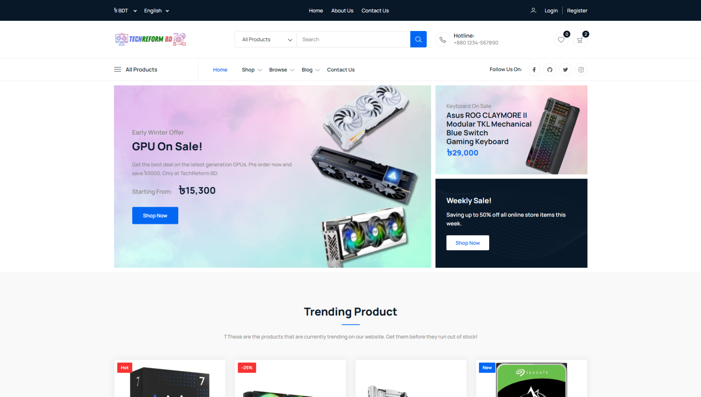 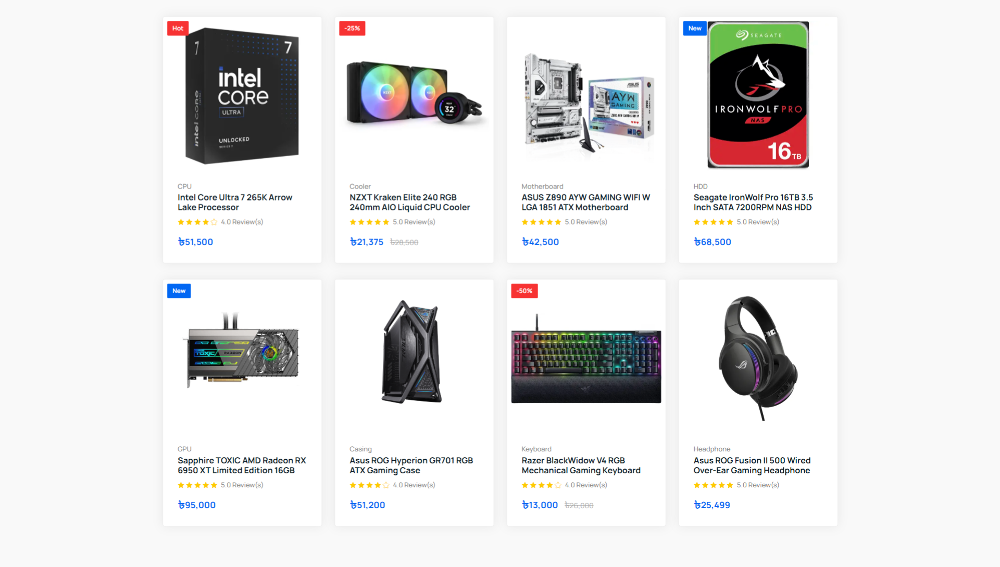  
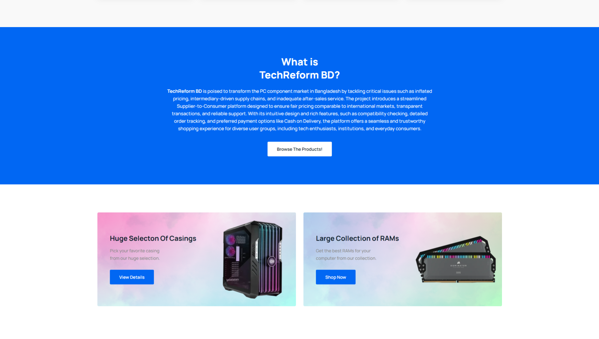 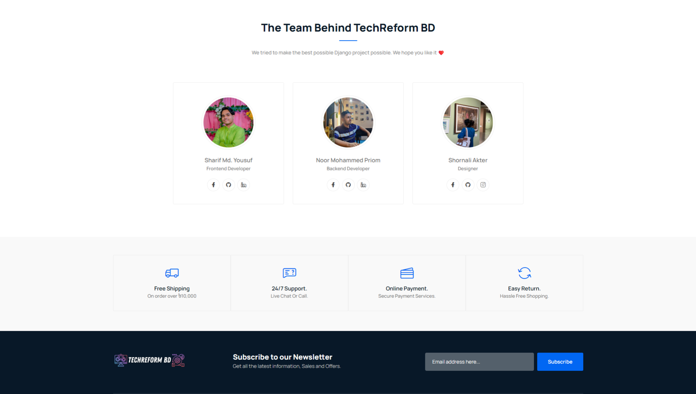

### **Products**

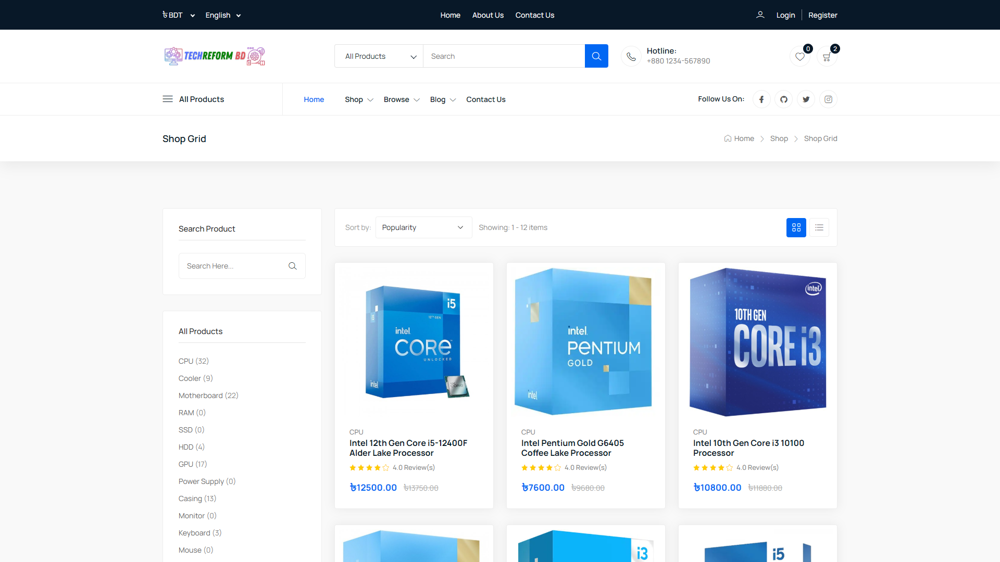 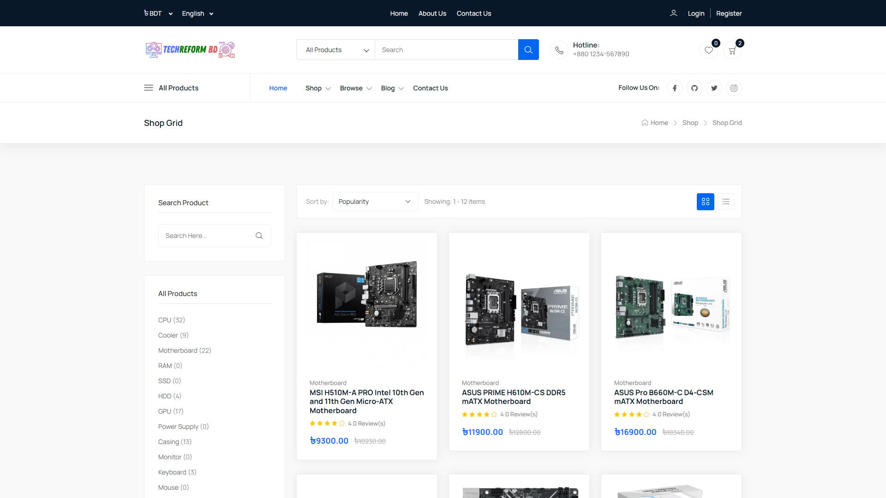

### **Authentication**

**Login:**  
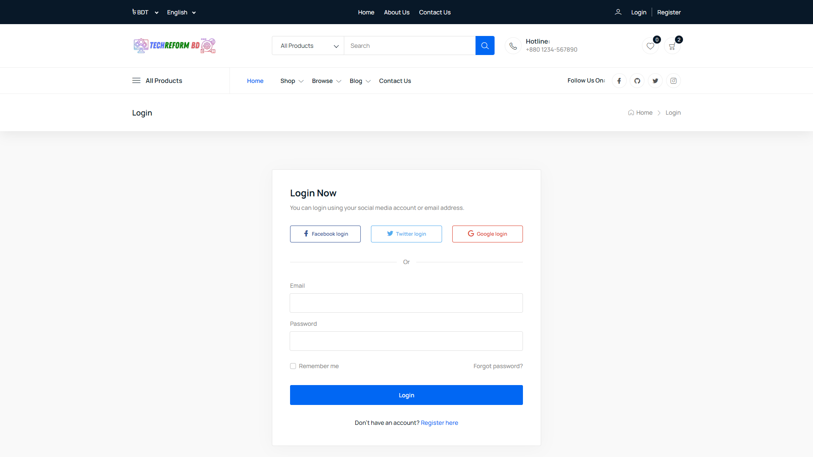  
**Register:**  
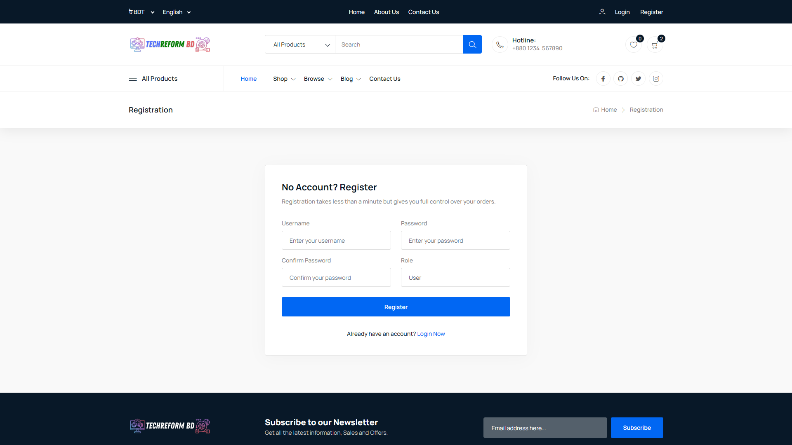

### **About Us**

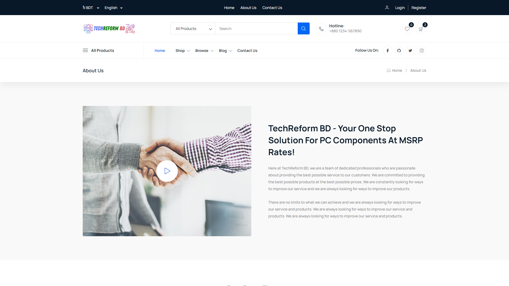

### **Contact Us**

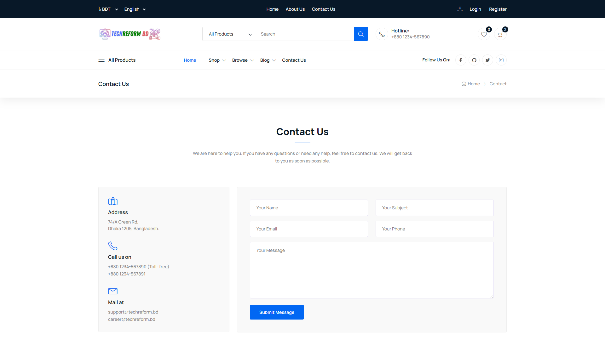

### **FAQ**

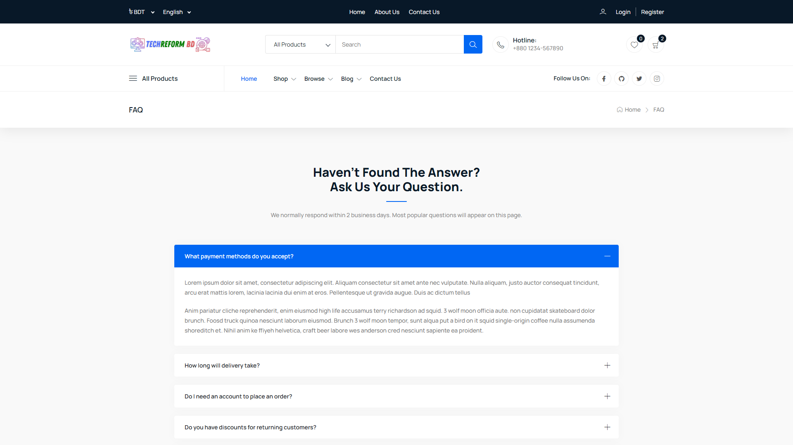

---

## **Meet the Developers 👨‍💻**

- **[Sharif Md. Yousuf](https://github.com/SharifdotG)**  
  *B.Sc. in CSE, UAP*

- **[Noor Mohammed Priom](https://github.com/SOrtINgmASteR)**  
  *B.Sc. in CSE, UAP*

- **[Shornali Akter](https://github.com/nudhar60)**  
  *B.Sc. in CSE, UAP*
